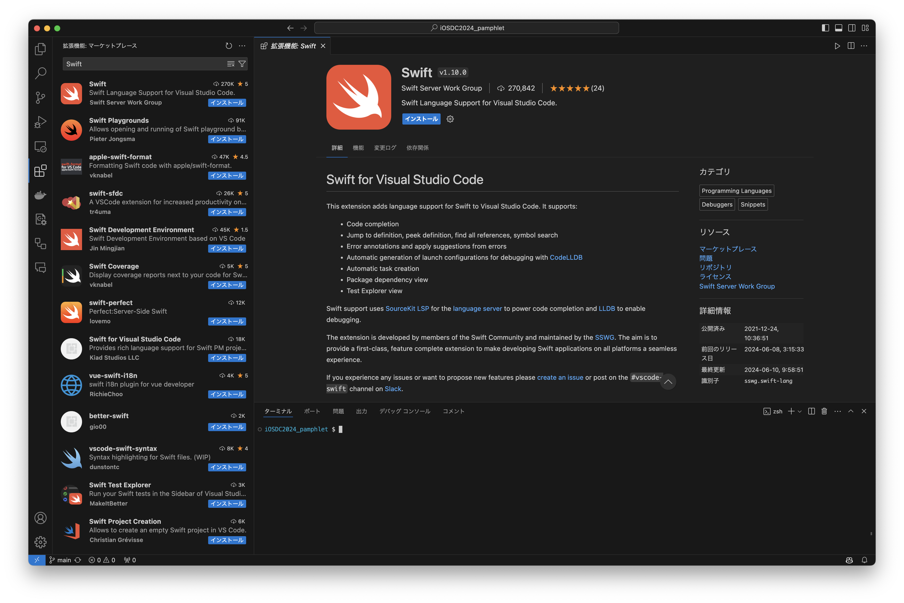
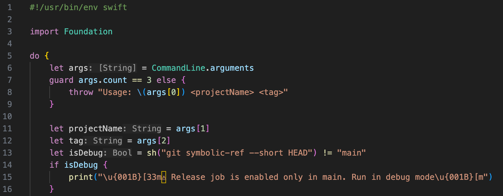
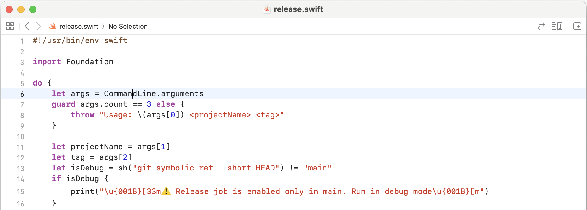

## はじめに
単純作業を自動化しようとするとまず選択肢に上がるのがシェルスクリプトですが、macで主要なbashやzshはどちらも癖が強く、文法を覚えるのも大変です。  

実は我々iOSエンジニアにとって主流なSwiftでもスクリプトを書くことができます。  
しかし標準の開発環境であるXcodeではSwiftスクリプトのサポートがほとんどされておらず、標準APIのコード補完すらできないのが現状です[^1]。

[^1]: 本稿執筆時点ではXcode 16が出ておらず、iOSDC 2024開催時点でもおそらくまだPublic Betaです。9月頃の正式版リリースで改善される可能性はあります。

一方、2023年1月にMicrosoft製のエディタであるVSCode向けにSwiftの拡張機能がリリースされています。
これにより、XcodeがなくてもSwiftを使った開発が容易になりました。  
また、VSCode上であればSwiftスクリプトでもコード補完が実現できるようになりました。

本稿では、VSCodeにSwift拡張機能を導入し、実際にSwiftスクリプトを書くための注意点を紹介します。


## 前提条件

執筆時点での環境は以下の通りです。

- Swift: 5.10
- VSCode: 1.90.0
- Swift for Visual Studio Code: v1.10.1

また、VSCodeのインストールについては省略します。
インストール方法は公式サイト等を参照してください。

## VSCodeにSwift拡張機能を導入する
まず、サイドバーの拡張機能タブを開きます。( `⌘+⇧+x` コマンドでも可 )。
次に、上部の検索窓に`Swift`と入力し、Returnキーを押すと一番上に`Swift`が表示されます。
検索結果から`Swift`を選択[^2]すると拡張機能の詳細が表示されます(図参照)。

詳細画面上部の「インストール」ボタンをクリックすると、Swift拡張機能がインストールされます。

[^2]: 検索結果の右側にある`インストール`ボタンをクリックすればそのままインストールが始まります

インストールが完了したらもうやることはありません。後は実際にSwiftでスクリプトを書くだけです。

### ちなみに

本稿では詳しくは触れませんが、Swift拡張機能をインストールするとVSCode上でSwift Packageの機能も使うことができるようになります。
スクリプトを扱う上では恩恵を受けることはあまりありませんが、Package開発をしている人であればターミナルを開くことなくPackageのビルドやテスト実行ができるのは嬉しい機能でしょう。




## 実際にVSCodeでSwiftスクリプトを書いてみよう

ここではSwiftでスクリプトを書くにあたって最低限気をつけるべきポイントを紹介します。

### Shebang
スクリプトファイルの1行目に書く`#!`から始まる行をShebang(シバン)といいます。
実行時のインタプリタを指定するためのもので、シェルスクリプトだと `#!/bin/sh` や `#!/bin/bash` 、 `#!/bin/zsh` がよく使われますね。

Swiftスクリプトの場合は `#!/usr/bin/swift` ではなく `#!/usr/bin/env swift` と書くのが良いです。
`#!/usr/bin/swift` だと、例えば `/usr/local/bin/swift` にインストールされた環境でスクリプトを実行するとエラーになりますが、`/usr/bin/env` を使うことで `PATH` から `swift` コマンドを探してくれます。

### import
スクリプトでは`Foundation`以外のimportは原則使えないと考えましょう。

厳密にはビルトインFrameworkであればimportはできますがコード補完が効きづらいですし、そこまで複雑なことをやるようであれば大人しくExecutableなSwift Packageを作成するのが良いです。

SwiftフォーラムではスクリプトでもPackageを扱えるような提案[^3]が出ていますが、2023年3月から更新されていないのが現状です。

[^3]: https://forums.swift.org/t/46717

#### 例外
Linuxでの動作を考慮して、以下のimportが必要になる場合があります。
これはスクリプトに限らず、Linux環境でも使えるPackageを作成する場合は同様の点に注意しましょう。

- `FoundationNetworking`  
`URL`や`URLSession`などのネットワーク関連のクラスを使う場合に必要です。
- `FoundationXML`  
`XMLParser`など、XMLを扱う場合に必要です。

これらをimportする際、`#if canImport ~ #endif`で囲むことによりmacOS、Linuxのどちらでもコンパイルが通るようになります。

```swift
#if canImport(FoundationNetworking)
import FoundationNetworking
#endif
```

### Swift Concurrency と `URLSession`
Swift 5.7からトップレベルでの`async/await`がサポートされました。
昨年のパンフレット記事[^4]でも触れているので、去年のパンフレットをお持ちの方はそちらも読んでいただけると幸いです。

しかし、Linux用の `URLSession` は `async/await` に直接対応していない[^5]ため、 `async/await` で扱うために `withCheckedThrowingContinuation` 等を使う必要があります。

[^4]: https://fortee.jp/iosdc-japan-2023/proposal/4f2e18ac-666b-4edc-b1aa-45bc81d102a6
[^5]: Swift 5.10現在

Linux環境下でも `async/await` でネットワーク通信を扱うためのワークアラウンドとして、Darwin環境向けに用意されている `async` なfunctionをextensionとして生やす方法があります。

```swift
#if os(Linux)
extension URLSession {
    func data(for request: URLRequest) async throws -> (Data, URLResponse) {
        try await withCheckedThrowingContinuation { cont in
            dataTask(with: request) { (data, response, error) in
                if let error {
                    cont.resume(throwing: error)
                } else if let data, let response {
                    cont.resume(returning: (data, response))
                } else {
                    cont.resume(throwing: URLError(.unknown))
                }
            }.resume()
        }
    }
}
#endif
```

### Functions、Extensions
スクリプトでもSwiftの言語仕様上扱えるものは基本的に全て扱えます。
関数や`extension`などもその1つです。
特にshellコマンドを実行する関数や`String`を直接`throw`できるような`extension`を作っておくと便利です。

### 実際に書いてみた例
以上を踏まえて、実際にSwiftスクリプトを書いてみましょう...と行きたいところですが、誌面が足りなくなってきたので実際にスクリプトをshからSwiftに置き換えた例として、筆者が個人で公開しているOSSライブラリ[^6]のリリース用スクリプトを一部抜粋して次ページに記載します。

[^6]: https://github.com/417-72KI/MultipartFormDataParser

変数の横に型が記載されていますが、これはVSCodeのSwift extensionが補完してくれているものになります。
また、commandキーを押しながら関数の部分をクリックすると定義にジャンプしてくれます。



なお、Xcodeで同じファイルを開くと、コード補完が全く効いていないことがわかります。
これだけでもVSCodeでスクリプトを書くメリットがあると言えるでしょう。



コード全体はGitHubに公開しているので、そちら[^7]をご覧ください。

[^7]: https://github.com/417-72KI/MultipartFormDataParser/pull/87

## 終わりに
VSCodeにSwift拡張機能を導入することで、Swiftスクリプトを簡単に書くことができるようになりました。

shellスクリプトに比べてファイルサイズが大きくなったり、`sed` や `awk` を使ってワンライナーで書けていた処理も複数行に分けないといけないといったデメリットはありますが、それらを差し引いても可読性や保守性の観点から慣れた言語でスクリプトを書けるメリットは大きいでしょう。

今までシェルスクリプトを使っていた人も、Swiftスクリプトに乗り換えてみてはいかがでしょうか？